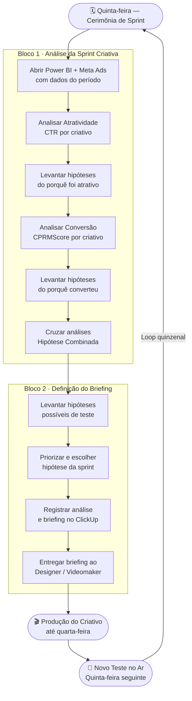

# Cerimônia de Sprint Criativa

---

## 📌 Informações Gerais

| Campo | Valor |
|---|---|
| **Responsável** | Líder de Conteúdo |
| **Versão** | 1.0 |
| **Data de criação** | 18/12/2025 |
| **Última atualização** | 13/05/2026 |
| **Status** | Aprovado |
| **Categoria** | Mídia Paga |

---

## 🎯 Objetivo

Analisar a performance dos criativos da sprint anterior e definir o briefing do próximo teste, com base em hipóteses separadas de atratividade e conversão.

---

## ⚡ Gatilho de Início

Quinzenal, toda quinta-feira.

---

## 🔄 Ciclo da Sprint Criativa

---

## 🛠️ Ferramentas e Acessos Necessários

- [ ] Power BI da Planning — acesso de leitura
- [ ] Meta Ads — acesso de leitura aos criativos e métricas
- [ ] ClickUp — acesso para registro de análises e briefings

---

## 👥 Participantes

| Cargo | Presença |
|---|---|
| Líder de Conteúdo | Obrigatória (facilita) |
| Head de Marketing | Obrigatória |
| Designer | Obrigatória |
| Videomaker | Quando o teste envolve vídeo |
| Especialista e Assistente de Conteúdo | Conforme pauta |

---

## 📋 Passo a Passo

### Passo 1 — Preparar os dados antes da reunião
> **Ferramenta:** Power BI + Meta Ads | **Tempo estimado:** 10 min

Abrir o Power BI da Planning e o dashboard de criativos no Meta Ads com os dados do período. Ter em mãos: CTR, CPRMScore e volume de investimento de cada criativo ativo.

---

### Passo 2 — Analisar atratividade (isolada)
> **Ferramenta:** Meta Ads | **Tempo estimado:** 20 min

Identificar qual criativo teve mais CTR. Levantar hipóteses do porquê foi mais atrativo — analisar cada dimensão separadamente: formato, gancho, marca, personagem, narrativa.

Registrar as hipóteses antes de passar para conversão.

---

### Passo 3 — Analisar conversão (isolada)
> **Ferramenta:** Power BI | **Tempo estimado:** 20 min

Identificar qual criativo teve melhor CPRMScore (North Star Metric — quanto menor, melhor) e maior volume de evento-alvo. Levantar hipóteses separadas do porquê converteu melhor.

As hipóteses de conversão devem ser distintas das de atratividade — são ângulos diferentes.

---

### Passo 4 — Cruzar as duas análises
> **Tempo estimado:** 10 min

Com as hipóteses de atratividade e conversão levantadas separadamente, cruzar as duas: o que une o criativo mais atrativo com o de melhor conversão? Essa interseção gera a hipótese combinada do próximo teste.

---

### Passo 5 — Levantar e priorizar hipóteses de teste
> **Tempo estimado:** 10 min

Listar todas as hipóteses possíveis a testar. Priorizar com base na hipótese combinada do Passo 4. Definir qual será o teste da próxima sprint e qual criativo ele vai desafiar (criativo controle).

---

### Passo 6 — Registrar análise e briefing no ClickUp
> **Ferramenta:** ClickUp | **Tempo estimado:** 5 min

Registrar na página correspondente do ClickUp:
- Hipóteses de atratividade e conversão da sprint
- Hipótese combinada escolhida
- Briefing do próximo teste (contexto, hipótese, formato, referências)

---

### Passo 7 — Entregar o briefing ao Designer e Videomaker
> **Tempo estimado:** 5 min

Passar o briefing registrado no ClickUp para Designer e Videomaker ainda na quinta-feira. O criativo deve estar pronto até a quarta-feira seguinte para que o novo teste inicie na próxima quinta.

---

## ✅ Critério de Qualidade

A cerimônia foi bem-executada quando:
- O time saiu com briefing definido e registrado no ClickUp
- Hipóteses de atratividade e conversão foram levantadas antes de cruzar
- O teste definido desafia o criativo controle em pelo menos uma dimensão
- CPRMScore foi o critério central para definir o criativo controle

---

## 🚫 O Que NÃO Fazer

- Misturar análise de atratividade com conversão antes de concluir cada uma separadamente
- Levantar hipóteses de um ângulo só e pular o cruzamento
- Sair da cerimônia sem briefing definido e registrado
- Manter o mesmo criativo indefinidamente sem desafiante (stop loss e critério de pausa são tratados em POP específico)

---

## 📝 Checklist do Executor

- [ ] Power BI e Meta Ads abertos com dados do período
- [ ] Hipóteses de atratividade levantadas e registradas
- [ ] Hipóteses de conversão levantadas e registradas
- [ ] Hipótese combinada definida
- [ ] Análise e briefing registrados no ClickUp
- [ ] Briefing entregue ao Designer/Videomaker

---

## 📎 Recursos e Referências

- Metodologia MECE (Mutuamente Exclusivo, Coletivamente Exaustivo) — base para análise separada de atratividade e conversão
- CPRMScore — North Star Metric do time de mídia paga

---

*POP gerado pelo Marketing OS — v1.0*

---

**Conexões:** [[automacoes/automacoes|automacoes]]
