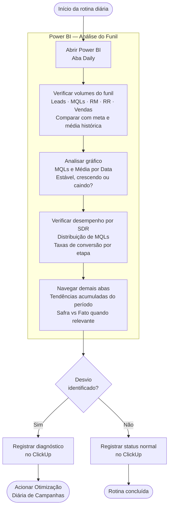

# Monitoramento Diário de Funil

---

## 📌 Informações Gerais

| Campo | Valor |
|---|---|
| **Responsável** | Gestor de Tráfego |
| **Versão** | 1.0 |
| **Data de criação** | 13/05/2026 |
| **Última atualização** | 13/05/2026 |
| **Status** | Aprovado |
| **Categoria** | Mídia Paga / Analytics |

---

## 🎯 Objetivo

Monitorar diariamente o volume e a evolução das etapas do funil de vendas no Power BI, identificando quedas de demanda ou desequilíbrios entre etapas antes que impactem o resultado do mês.

---

## ⚡ Gatilho de Início

Diário — primeira ação da rotina de mídia paga do dia.

---

## 🔄 Fluxo da Rotina

---

## 🛠️ Ferramentas e Acessos Necessários

- [ ] Power BI da Planning — acesso de leitura (abas: Daily e demais)

---

## 📋 Passo a Passo

### Passo 1 — Abrir Power BI e verificar volumes do funil
> **Ferramenta:** Power BI — aba Daily | **Tempo estimado:** 10 min

Verificar os volumes do dia e acumulado do período: Leads gerados, MQLs, Reuniões Marcadas (RM), Reuniões Realizadas (RR) e Vendas. Usar o botão **Safra** para garantir que os dados reflitam leads gerados dentro da janela de análise, sem contaminação de conversões de períodos anteriores. Comparar com as metas do período e com a média histórica visível no dashboard.

---

### Passo 2 — Analisar a evolução diária da demanda
> **Ferramenta:** Power BI — aba Daily | **Tempo estimado:** 5 min

Observar o gráfico "MQLs e Média por Data". Identificar se a geração de demanda está estável, crescendo ou caindo ao longo dos dias. Quedas de 2 ou mais dias consecutivos abaixo da média são sinal de alerta.

---

### Passo 3 — Verificar desempenho por SDR
> **Ferramenta:** Power BI — aba Daily | **Tempo estimado:** 5 min

Checar a distribuição de MQLs entre os SDRs e as taxas de conversão por etapa (MQL → RM, RM → RR, RR → Venda). Desequilíbrios entre SDRs ou quedas em uma etapa específica indicam onde a demanda está travando.

---

### Passo 4 — Navegar pelas demais abas
> **Ferramenta:** Power BI | **Tempo estimado:** 5 min

Verificar tendências acumuladas do período e comparar safra vs fato quando relevante para entender se o padrão do dia é pontual ou reflexo de uma tendência maior.

---

### Passo 5 — Registrar no ClickUp
> **Ferramenta:** ClickUp | **Tempo estimado:** 5 min

Registrar o status do dia: volume de demanda gerada (está na meta?), alguma etapa do funil com queda relevante, e se a Otimização Diária de Campanhas foi acionada. Registrar mesmo quando tudo está normal — o histórico de dias dentro da meta é igualmente valioso.

---

## ✅ Critério de Qualidade

A rotina foi bem executada quando: os volumes de todas as etapas do funil foram verificados com safra aplicada, a evolução diária e o desempenho por SDR foram analisados, e o registro no ClickUp reflete o estado real do dia.

---

## 🚫 O Que NÃO Fazer

- Analisar leads sem o filtro de safra — distorce as taxas de conversão
- Registrar apenas quando há problema
- Usar esta rotina para analisar CPMQL ou CPRMScore por campanha — essa análise é feita na Otimização Diária de Campanhas, pela aba "Detalhes de Campanhas"

---

## 📝 Checklist do Executor

- [ ] Power BI aberto, aba Daily verificada
- [ ] Volumes do funil conferidos com safra aplicada
- [ ] Gráfico de evolução diária analisado
- [ ] Desempenho por SDR verificado
- [ ] Demais abas navegadas
- [ ] Registro feito no ClickUp
- [ ] Se necessário: Otimização Diária de Campanhas acionada

---

*POP gerado pelo Marketing OS — v1.0*
