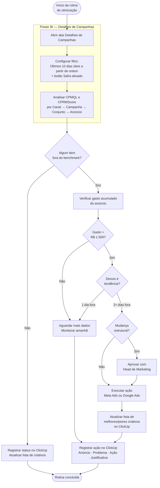

# Otimização Diária de Campanhas (Meta Ads + Google Ads)

---

## 📌 Informações Gerais

| Campo | Valor |
|---|---|
| **Responsável** | Gestor de Tráfego |
| **Versão** | 1.0 |
| **Data de criação** | 13/05/2026 |
| **Última atualização** | 13/05/2026 |
| **Status** | Aprovado |
| **Categoria** | Mídia Paga |

---

## 🎯 Objetivo

Analisar diariamente os indicadores de custo por resultado no Power BI (aba Detalhes de Campanhas) e executar ações corretivas em Meta Ads e Google Ads com critérios objetivos de pausa, ajuste e registro.

---

## ⚡ Gatilho de Início

Diário — após o Monitoramento Diário de Funil ou como rotina fixa de otimização, mesmo sem alerta prévio.

---

## 🔄 Fluxo da Rotina

---

## 🛠️ Ferramentas e Acessos Necessários

- [ ] Power BI da Planning — acesso de leitura (aba Detalhes de Campanhas)
- [ ] Meta Ads Manager — acesso de operação
- [ ] Google Ads — acesso de operação (campanhas Search)
- [ ] ClickUp — registro de ações e lista de criativos

---

## 📊 Benchmarks de Referência

> Atualizar no início de cada mês conforme planejamento aprovado.

| Canal | CPMQL Meta | CPRMScore Meta | Budget Mensal |
|---|---|---|---|
| Meta Ads | R$ 245 | R$ 349,60 | R$ 170.000 |
| Google Ads | R$ 1.000 | R$ 1.071,60 | R$ 50.000 |

---

## 📋 Passo a Passo

### Passo 1 — Configurar filtro no Power BI
> **Ferramenta:** Power BI — aba Detalhes de Campanhas | **Tempo estimado:** 3 min

Abrir a aba "Detalhes de Campanhas". Antes de qualquer leitura, configurar o período para os **últimos 10 dias úteis a partir de ontem** (o dia de hoje não entra — os dados ainda estão incompletos) e ativar o botão **Safra**. Esses dois passos são obrigatórios: sem eles, os números não refletem a realidade operacional do período.

---

### Passo 2 — Analisar indicadores por nível
> **Ferramenta:** Power BI | **Tempo estimado:** 15 min

Descer do macro para o micro: Canal → Campanha → Conjunto de anúncios → Anúncio. Para cada nível, comparar CPMQL e CPRMScore com os benchmarks da tabela acima. Identificar onde está o desvio e em qual nível ele aparece.

---

### Passo 3 — Aplicar critério de stop loss
> **Tempo estimado:** 5 min

Para cada anúncio fora do benchmark, verificar o gasto acumulado:
- **Abaixo de R$ 1.500:** não pausar ainda — dado insuficiente para decisão. Monitorar no dia seguinte.
- **Acima de R$ 1.500 sem conversão qualificada:** pausar.

---

### Passo 4 — Avaliar se é tendência ou variação pontual
> **Tempo estimado:** 5 min

- **1 dia fora do benchmark:** monitorar, não agir ainda.
- **2 ou mais dias consecutivos fora:** agir.

Esse critério evita pausas precipitadas por oscilação normal de performance.

---

### Passo 5 — Executar a ação no canal correspondente
> **Ferramenta:** Meta Ads Manager ou Google Ads | **Tempo estimado:** 10 min

Ações dentro da alçada do Gestor de Tráfego:
- Pausar criativo ou anúncio com baixo desempenho
- Ajustar lance ou orçamento de conjunto/grupo de anúncios
- Realocar budget entre conjuntos dentro de uma campanha

Ações que requerem aprovação prévia do Head de Marketing:
- Alteração de budget total de campanha
- Pausar ou criar campanha inteira
- Mudanças na estrutura de segmentação ou objetivos de campanha

---

### Passo 6 — Atualizar lista de criativos no ClickUp
> **Ferramenta:** ClickUp | **Tempo estimado:** 5 min

Registrar ou atualizar na lista de melhores/piores criativos: nome do criativo, canal, CTR, CPMQL e CPRMScore do período, e status atual (ativo, pausado ou em teste). Essa lista é a principal fonte de dados para a Cerimônia de Sprint Criativa — mantê-la atualizada diariamente garante que a cerimônia parta de dados reais.

---

### Passo 7 — Registrar ação no ClickUp
> **Ferramenta:** ClickUp | **Tempo estimado:** 5 min

Para cada ação executada, registrar: qual anúncio/conjunto/campanha foi afetado, qual métrica justificou a ação e qual era o desvio, e qual foi a ação tomada com justificativa. Registrar também os dias em que não houve ação — o histórico de estabilidade é dado relevante.

---

## ✅ Critério de Qualidade

A rotina foi bem executada quando: o filtro de 10 dias úteis e o botão Safra foram configurados antes de qualquer leitura, cada item fora do benchmark foi avaliado pelo critério de stop loss, toda ação tem registro com justificativa, e a lista de criativos no ClickUp está atualizada.

---

## 🚫 O Que NÃO Fazer

- Analisar sem configurar os 10 dias úteis a partir de ontem e sem ativar o botão Safra
- Pausar anúncio com menos de R$ 1.500 de gasto
- Executar mudança estrutural sem aprovação do Head de Marketing
- Usar a aba Daily para análise de custo — a aba correta é "Detalhes de Campanhas"
- Deixar a lista de criativos sem atualização — ela alimenta diretamente a Cerimônia de Sprint Criativa

---

## 📝 Checklist do Executor

- [ ] Aba Detalhes de Campanhas aberta
- [ ] Filtro: últimos 10 dias úteis a partir de ontem configurado
- [ ] Botão Safra ativado
- [ ] CPMQL e CPRMScore analisados por canal, campanha, conjunto e anúncio
- [ ] Stop loss (R$ 1.500) aplicado a cada avaliação de pausa
- [ ] Tendência verificada antes de agir (1 dia = monitorar, 2+ dias = agir)
- [ ] Mudanças estruturais aprovadas pelo Head de Marketing
- [ ] Lista de criativos atualizada no ClickUp
- [ ] Ações registradas no ClickUp com justificativa

---

*POP gerado pelo Marketing OS — v1.0*

---

**Conexões:** [[automacoes/automacoes|automacoes]]
